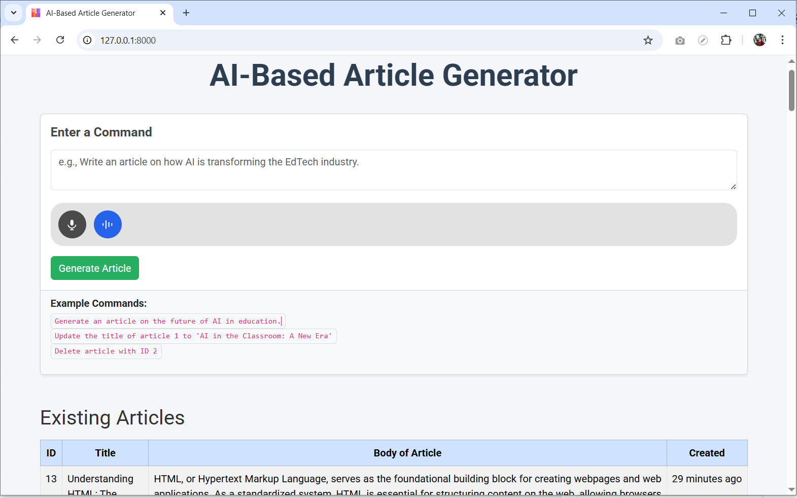

# AI-Based Article Generator

Welcome to the **AI-Based Article Generator** — a web application that allows users to generate, edit, and manage AI-generated articles through simple natural language commands.

---

## 🧠 Features

- ✅ Generate articles using natural language prompts.
- 📝 Update article titles or content easily.
- ❌ Delete articles by ID.
- 📜 View existing articles with ID, title, body, and creation date.

---

## 🚀 How to Use

### 🔹 Enter a Command

Use natural language instructions in the input box to interact with the AI.

### 🔸 Example Commands:

- `Write an article on how AI is transforming the EdTech industry.`
- `Generate an article on the future of AI in education.`
- `Update the title of article 1 to 'AI in the Classroom: A New Era'.`
- `Delete article with ID 2.`

---

## 📋 Existing Articles Table

The application displays the following article details in a structured table:

| ID | Title | Body of Article | Created |
|----|-------|------------------|---------|
| 1  | AI in Education | ... | 2025-07-22 |
| 2  | Future of EdTech | ... | 2025-07-21 |

---

## 🛠️ Tech Stack

- **Laravel** + **Livewire**
- **OpenAI GPT-4 API**
- **Bootstrap** for UI
- **MySQL** database

---

## 📸 Screenshot

> _Add a real screenshot of your UI here for better visual presentation._

---

## 🤖 Credits

Developed by **Md. Rony Ahmmed Shah**  
Student ID **2002035**  
Dept. of Educational Technology and Engineering (EdTE)  
Digital University, Bangladesh

---

## 📬 Contact

📧 Email: `bdu.rony@gmail.com`  
🌐 Facebook: [EdTech & Engineering](https://facebook.com/EdTech4)

---

>  Thank You
